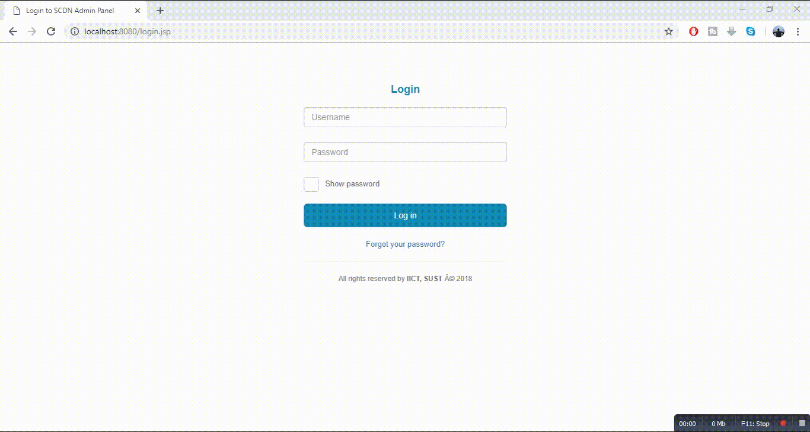

# SUST CSE Developer Network Lab

Website for SUST CSE Developers Network. My first working website, developed in academic Web Engineering lab. But project is incomplete. It is just a demo with some working feature.

## Getting Started

The overall project is in two part. One is the main one page site. And another one is the Admin Panel.

### Prerequisites

You need to install these softwares to run the project.

* [IntelliJ IDEA (Ultimate Edition)](https://www.jetbrains.com/idea/download/#section=windows) - This IDE is used to developed the website.
* [XAMPP](https://www.apachefriends.org/index.html) - The Apache Server for MySQL Database.

### Necessary Jar Files

You might need these jar files to run the project.

* [mysql-connector-java-5.1.2.jar](http://www.java2s.com/Code/Jar/m/Downloadmysqlconnectorjava512jar.htm)
* [servlet-api.jar](http://www.java2s.com/Code/Jar/s/Downloadservletapijar.htm)
* [gson-2.2.2.jar](http://www.java2s.com/Code/Jar/g/Downloadgson222jar.htm)
* [java-json.jar](http://www.java2s.com/Code/Jar/j/Downloadjavajsonjar.htm)

## Project Demo

Here is the project demo.

